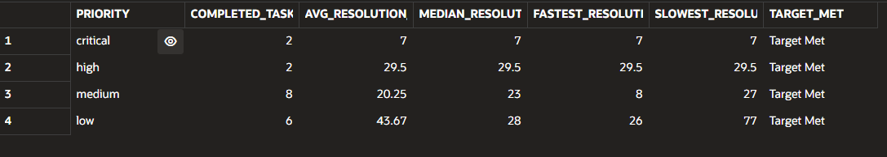
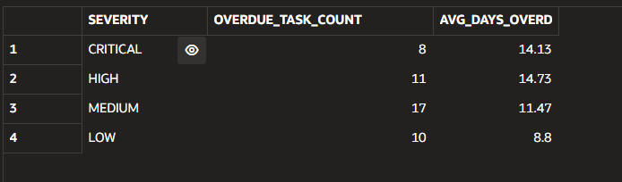
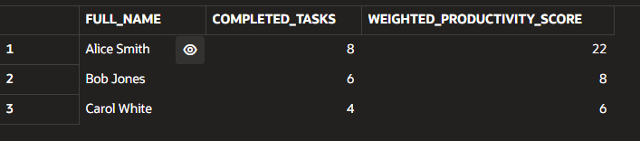
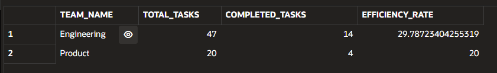
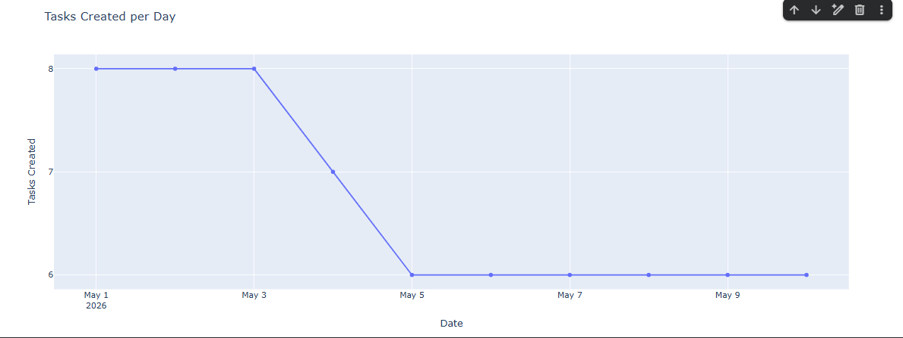
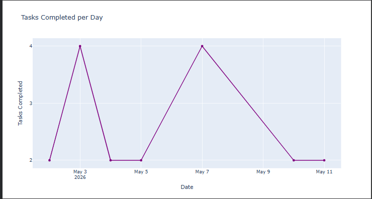
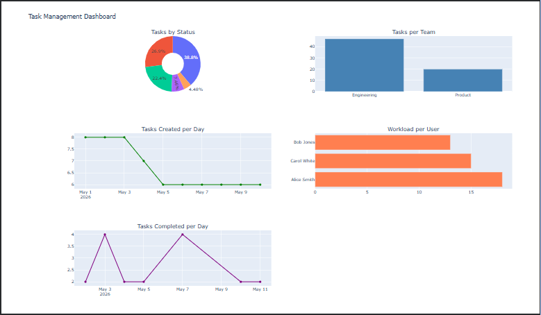

## PART A: The KPI Contract
### Exercise 1: Define "Team velocity"
1. **What is the business question?**
* Which teams complete work faster compared to other teams?
2. **What is the exact definition? (Include every filter, every join)**
* Team velocity measures the relative execution rate of delivery groups. It

evaluates total throughput normalized by headcount constraints to eliminate capacity-
based distortion.

* **Formula:** `completed_tasks / number_of_team_members`
* **Constraints & Rules:**
* Filter: `status = 'Completed'` exclusively.
* Join Logic: Assumes strict unique mapping where each developer belongs to a
single team entity.
* Normalization: Vital because engineering scale differs drastically (e.g., a
20-person backend engine vs. a 5-person infrastructure pod). Normalizing ensures
small agile teams are not systematically penalised for lower aggregate output
numbers.
3. **What are the edge cases? (NULLs, cancelled tasks, unassigned tasks, etc.)**
* **Null/Corrupted Status Fields:** Filtered out from final processing.
* **Unassigned Work Items:** Suppressed entirely due to lack of team context
routing.
* **Empty Teams:** Zero-count headcounts must bypass calculation filters to avoid
fatal division-by-zero runtime exceptions.
* **Cancelled Items:** Omitted since they do not reflect complete lifecycle
execution loops.
4. **What is the unit? (Count, percentage, hours, dollars?)**
* Tasks completed per employee.
5. **What would make this metric misleading?**
* **Complexity Deafness:** Treats simple updates and complex architecture rewrites
identically. A team working on localized tickets will falsely appear superior to a
squad tackling core infrastructure refactoring.
* **Role Variability:** Functional support teams or operations-focused pods will
show suppressed metrics compared to pure feature delivery squads.
* **Pro & Con Matrix:**
* *Pros:* Standardizes operational comparisons across uneven organization
scales; exposes underlying productivity velocity relative to actual capacity.
* *Cons:* Masks individual variance behind team averages; acts as an incentive
for volume over architectural health or technical debt resolution.

### Exercise 2: Define "On-Time Delivery Rate"
1. **What is the business question?**
* How often are tasks completed before their deadlines?

1

2. **What is the exact definition? (Include every filter, every join)**
* The percentage of closed deliverables completed prior to or matching their
designated cutoff parameters.
* **Formula:** `(on_time_completed_tasks / total_completed_tasks_with_due_dates) *
100`
* **Operational Rules:**
* Base Condition: Target records must hit `status = 'completed'`.
* Evaluation Boundary: On-time classification is true if and only if
`completed_at <= due_date`.
* Exclusion: Records lacking explicit `due_date` milestones are completely
dropped from calculations.
3. **What are the edge cases? (NULLs, cancelled tasks, unassigned tasks, etc.)**
* **Timestamp Boundaries:** A task logged at 23:59 on the deadline date is
strictly on time; a log at 00:01 the following day is marked late.
* **Incomplete Records:** Null values in `completed_at` or `due_date` drop the
record from the evaluation queue.
* **State Exclusions:** Open or explicitly cancelled issues are never evaluated
for timeliness.
4. **What is the unit? (Count, percentage, hours, dollars?)**
* Percentage (%) supplemented by average lateness intervals quantified in hours.
5. **What would make this metric misleading?**
* Deadlines are subjective; a high rate might indicate artificially extended
safety buffers rather than true execution efficiency. Small delays of a few minutes
carry the same penalty as week-long slips, hiding the actual scale of delays. This
dynamic often compromises work quality when engineers rush deployments just to
protect the metric.

---
## PART B: Improve the Class KPIs
### Exercise 3: Improve "Tasks per Team" (KPI 2 from class)
1. **What is the business question?**
* Which teams currently have the highest workload and how efficiently are they
completing tasks?
2. **What is the exact definition? (Include every filter, every join)**
* A multi-tier volume breakdown assessing total pipeline exposure against live
processing constraints.
* **Metric Components:**
* `total_tasks`: Aggregate count of all work tickets mapped to users within a
target team boundary.
* `active_tasks`: Subset count filtering active processing tracks: `status IN

2

('open', 'in_progress', 'blocked')`.
* `completion_rate`: `completed_tasks / (total_tasks - cancelled_tasks) * 100`
3. **What are the edge cases? (NULLs, cancelled tasks, unassigned tasks, etc.)**
* **Zero-Load Entities:** Teams with empty backlogs must register a clean zero
without dropping from report visibility.
* **Cancelled Items:** Removed from the denominator to avoid deflating true
operational efficiency calculations.
* **Ownership Gaps:** Tickets without explicit group or individual mapping are
ignored.
4. **What is the unit? (Count, percentage, hours, dollars?)**
* `total_tasks` & `active_tasks` = Numeric Count; `completion_rate` = Percentage
(%).
5. **What would make this metric misleading?**
* Raw volume does not equate to intense resource utilization. Teams handling a
high volume of trivial tasks will appear highly productive or heavily loaded, while
teams handling a small number of critical, multi-system initiatives will appear
under-utilized.
### Exercise 4: Improve "Average Resolution Time" (KPI 5 from class)
1. **What is the business question?**
* How quickly are tasks resolved depending on their priority?
2. **What is the exact definition? (Include every filter, every join)**
* Measures the duration between initial ingestion stamp and terminal state
confirmation, broken down across priority groupings.
* **Calculation Range:** `completed_at - created_at` (Converted to standard
hours).
* **Group Categorization:** Explicit breakdown by `priority` labels (`critical`,
`high`, `medium`, `low`).
3. **What are the edge cases? (NULLs, cancelled tasks, unassigned tasks, etc.)**
* **Open Lifecycles:** Active or uncompleted tickets are ignored until terminal
closure.
* **Low Sample Inconsistencies:** Priority tiers with scarce items run the risk of
showing volatile averages.
* **Outlier Distortions:** Massive, blocked tasks pull averages up artificially;
parsing the statistical median instead is highly recommended to stabilize analysis.
4. **What is the unit? (Count, percentage, hours, dollars?)**
* Hours.
5. **What would make this metric misleading?**
* Complex initiatives natively demand longer development lifecycles. Aggregating
averages without filtering out exceptional long-tail engineering blockers skews
operational visibility.

3

### Exercise 5: Improve "Overdue Tasks"
1. **What is the business question?**
* Which overdue tasks represent the biggest operational risk?
2. **What is the exact definition? (Include every filter, every join)**
* Filters and reports active risk indicators where commitments have slipped past
clear calendar goals, categorized by severity levels.
* **Filter Logic:** `due_date < TRUNC(SYSDATE) AND status NOT IN ('completed',
'cancelled')`
* **Severity Classification Engine:**
* `CRITICAL`: `priority = 'critical' AND days_overdue > 0`
* `HIGH`: `priority = 'high' AND days_overdue > 2`
* `MEDIUM`: `priority = 'medium' AND days_overdue > 5`
* `LOW`: All other matching past-due records.
3. **What are the edge cases? (NULLs, cancelled tasks, unassigned tasks, etc.)**
* **Current Expiry:** Tickets hitting their deadline today are not overdue.
* **Indeterminate Dates:** Items with null due dates are skipped.
* **Hidden Risk:** Very old, low-priority tasks can become deeply embedded
systemic problems if ignored long-term.
4. **What is the unit? (Count, percentage, hours, dollars?)**
* Days overdue (Integer count).
5. **What would make this metric misleading?**
* Assumed priorities do not always align with real-world business impact. Teams
may deliberately deprioritize low-risk items to protect critical pathways, creating a
false impression of operational failure.

---
## PART C: The "Bad KPI" challenge
### Exercise 6: Fix the "Productivity Score"
1. **What is the business question?**
* Which users consistently complete meaningful work efficiently over time?
2. **What is the exact definition? (Include every filter, every join)**
* A daily throughput score that weights task significance against a developer's
active timeline.
* **Weight Allocation Matrix:**
* `critical` = 4 pts | `high` = 3 pts | `medium` = 2 pts | `low` = 1 pt
* **Formula:** `total_weighted_points / active_work_days`

4

* **Operational Bounds:**
* `active_work_days` calculation: `MAX(completed_at) - MIN(completed_at) + 1`
* Joins: `users u LEFT JOIN tasks ts ON ts.assigned_to = u.id`
* Filter: Must enforce `status = 'completed'` and ensure `completed_at IS NOT
NULL`.
3. **What are the edge cases? (NULLs, cancelled tasks, unassigned tasks, etc.)**
* **Inactive Users:** Engineers with no completions are explicitly dropped from
reporting.
* **Single-Task Inflation:** A developer resolving just one heavy item on a single
active day can present a short-term, unsustainably high peak score.
* **Granularity Errors:** Priority fields serve as loose approximations and can
fail to capture unique engineering complexities.
4. **What is the unit? (Count, percentage, hours, dollars?)**
* Weighted productivity points per active day.
5. **What would make this metric misleading?**
* The metric overlooks key collaborative contributions, such as code reviews,
architecture syncs, and mentorship. Short, bursty completion cycles will also skew
scores higher compared to stable, long-term engineering contributions.

### Exercise 7: Fix the "Team Efficiency"
1. **What is the business question?**
* Which teams complete the highest proportion of their work?
2. **What is the exact definition? (Include every filter, every join)**
* High-level backlog conversion efficiency tracking successful asset delivery.
* **Formula:** `completed_tasks / total_non_cancelled_tasks * 100`
* **Relational Join Hierarchy:** `teams t INNER JOIN users u ON u.team_id = t.id
INNER JOIN tasks ts ON ts.assigned_to = u.id`
* **Filter Bounds:** Excludes explicit cancellations from denonimator pipelines;
isolates metrics to active team backlogs.
3. **What are the edge cases? (NULLs, cancelled tasks, unassigned tasks, etc.)**
* **Unstarted Teams:** Groups with empty queues must show a clean zero.
* **Pure Cancellation Scenarios:** Teams with only cancelled items must handle
null fields safely to avoid division errors.
* **Strategic Open States:** Complex architectural milestones naturally remain
open across multiple sprint boundaries, which temporarily lowers efficiency readings.
4. **What is the unit? (Count, percentage, hours, dollars?)**
* Percentage (%).
5. **What would make this metric misleading?**
* It treats minor documentation changes and large-scale service migrations as

5

equal values. Teams executing difficult, multi-week feature sets will appear
inefficient compared to teams closing high-volume, low-effort support tickets.

### Exercise 8: Fix the "Urgency Index"
1. **What is the business question?**
* Which tasks require immediate attention?
2. **What is the exact definition? (Include every filter, every join)**
* A dynamic risk index combining priority values with impending deadline windows.
* **Formula Metrics:** `priority_weight + overdue_impact`
* Priority Weights: `critical = 4`, `high = 3`, `medium = 2`, `low = 1`
* Due Interval Delta: `due_date - CURRENT_DATE`
* **Filter State:** Excludes completed or cancelled line records.
3. **What are the edge cases? (NULLs, cancelled tasks, unassigned tasks, etc.)**
* **Missing Targets:** Tasks without explicit due dates are skipped.
* **Accumulated Delay Distortion:** Old, low-priority backlog items can build up
high urgency scores over time, potentially outranking fresh, high-priority tasks.
* **Same-Day Interpretations:** Items due today require localized, hour-specific
handling.
4. **What is the unit? (Count, percentage, hours, dollars?)**
* Numeric urgency score.
5. **What would make this metric misleading?**
* Static priority variables do not always match real-time shifts in business
operations. The index also fails to evaluate underlying task blockers or system
dependency chains.

---
## Graphics
### KPI 1 — Tasks by Status

### KPI 2 — Tasks per Team

### KPI 3 — Workload per User

### KPI 4 & 5 — Completion Rate + Avg Resolution

6

### KPI 6 — Tasks Created per Day

### KPI 7 — Overdue Tasks

### KPI 8 — Priority Distribution

### Tasks completed per day

### Full Dashboard
